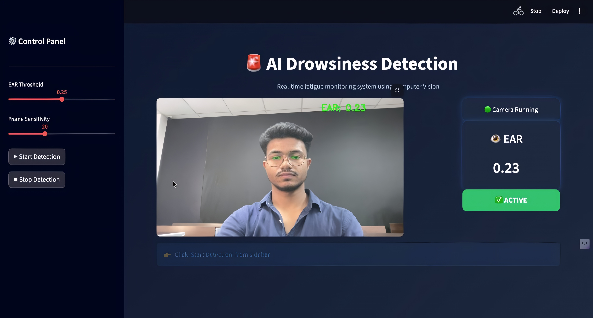
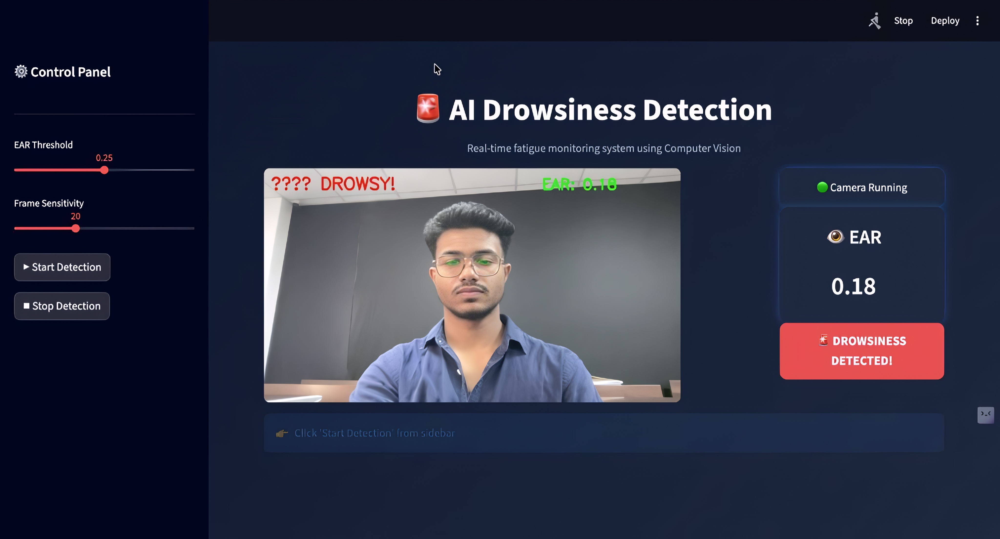

# 🚨 Real-Time Fatigue Detection using Computer Vision

A real-time AI-based system that detects human fatigue using facial landmark analysis and triggers alerts to prevent accidents and improve safety.

---

## 📌 Overview

This project leverages **OpenCV and dlib** to monitor eye movements and compute the **Eye Aspect Ratio (EAR)** in real-time.

If the eyes remain closed beyond a defined threshold for consecutive frames, the system triggers an alert sound.

---

## 🎯 Applications

* 🚗 Smart safety systems (not limited to drivers)
* 🏭 Industrial worker monitoring
* 🧠 Attention tracking systems
* 💻 Student focus monitoring

---

## 🧠 How It Works

* Detects face using dlib’s HOG-based detector
* Extracts 68 facial landmarks
* Isolates eye regions
* Computes Eye Aspect Ratio (EAR)
* If EAR falls below threshold → 🚨 triggers alert

---

## 📐 Eye Aspect Ratio (EAR)

```
EAR = (||p2 - p6|| + ||p3 - p5||) / (2 * ||p1 - p4||)
```

* 👁 Open eyes → EAR ≈ 0.25–0.30
* 😴 Closed eyes → EAR ≈ 0.10–0.15

---

## ⚙️ Tech Stack

* Python
* OpenCV
* dlib
* imutils
* SciPy
* Streamlit
* pygame

---

## 📦 Installation

```bash
git clone https://github.com/SR-Pradhan/real-time-fatigue-detection.git
cd real-time-fatigue-detection

python -m venv venv310
source venv310/bin/activate

pip install -r requirements.txt
pip install dlib-bin
```

---

## 📁 Project Structure

```
real-time-fatigue-detection/
│
├── Drowsiness_Detection.py   # Core detection logic
├── app.py                    # Streamlit UI
├── assets/
│   ├── alarm.wav
│   └── screenshots/
│       ├── terminal_view.png
│       ├── streamlit_view.png
│       └── alert_view.png
├── models/
│   └── shape_predictor_68_face_landmarks.dat
├── requirements.txt
└── README.md
```

---

## ▶️ How to Run

### 🔹 OpenCV Version (Real-time Detection)

```bash
source venv310/bin/activate
python Drowsiness_Detection.py
```

---

### 🔹 Streamlit Version (Interactive UI)

```bash
source venv310/bin/activate
python -m streamlit run app.py
```

---

## 🖥️ Project Execution (Real-Time)

### 🔹 Terminal-Based Detection (OpenCV)


* Real-time webcam-based detection
* EAR value displayed on screen
* Alert triggered when EAR drops below threshold
* Visual warning: **DROWSINESS ALERT**
* Audio alarm using pygame

---

## 🖥️ Project Execution (Real-Time)

---

## 🔹 Terminal-Based Detection (OpenCV)


* Real-time webcam-based detection
* Eye Aspect Ratio (EAR) displayed live on screen
* Visual alert shown when fatigue is detected (`DROWSINESS ALERT`)
* EAR value drops significantly during drowsiness
* Audio alarm triggered using pygame

---

## 🔹 Streamlit Dashboard (Interactive UI)





* Live webcam feed integrated into dashboard
* Real-time EAR monitoring panel
* Adjustable EAR threshold and frame sensitivity
* Status indicator (Active / Drowsiness Detected)
* Clean and interactive UI for better user experience

---

---

## 🚀 Features

* Real-time fatigue detection
* Eye Aspect Ratio (EAR) monitoring
* Audio alert system
* Streamlit-based UI dashboard
* Adjustable sensitivity controls

---

## 📊 Results

* 👁 Eye tracking
* 📉 EAR-based fatigue detection
* 🚨 Real-time alert system
* 🔊 Audio notifications

---

## 💡 Future Improvements

* Yawn detection
* Head pose estimation
* WebRTC-based deployment
* Accuracy metrics dashboard

---

## 💼 Resume Description

Developed a real-time fatigue detection system using computer vision techniques, leveraging facial landmark analysis and EAR-based metrics, integrated with an interactive Streamlit dashboard for monitoring and alerting.

---

## 👨‍💻 Author

**Sruti Ranjan Pradhan**

---

## 📜 License

This project is licensed under the MIT License.
